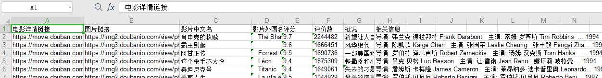
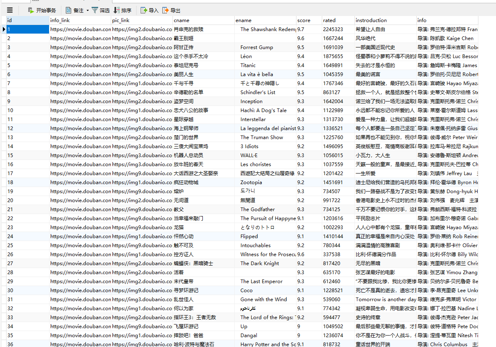

## 1、需求来源

这个是b站上一个播放量很高的爬虫教学视频,爬的是豆瓣电影。实现方案与`SIM流量爬取`不一样，`SIM流量爬取`的系统需要登录，这个豆瓣是不需要登录的，信息基本上爬的是页面上的数据。`SIM流量爬取`可以说是有点投机取巧吧,把需求实现了。虽然是练习，但是很重要，后面做项目爬boss，新浪微博,淘宝评论链接等可能会用到。后面项目试着自己敲一下！！！就用的这些知识点，去爬亚马逊，获取商品信息，存到excel当中,用的套路一样的,这也是爬取的一种方式，与之前使用selenium自动化实现方式有所不同。因为之前那个需要登录。没办法直接获取到这个页面。

        request根据不同的url获取html页面 -> bs4解析页面获取相应数据->入表（库）

## 2、实现方案

数据采集部分大致的实现思路：

- askURL(url)， requests发送请求，获取html页面 这个函数返回html页面，视频用的是url.lib,我这里改了一下
- getData(baseurl) ， 这个其实就是bs4解析的html页面，并且把数据存到列表中的过程，一条记录一个列表，最后添加到一个总列表返回

存储

- saveData(datalist,savepath) 存储方式1: 存到excel中
- saveData2(datalist,dbpath)  存储方式2: 存到sqlite3中

可视化展示

- 后面另外一个介绍，不在这里说了。

需要提的是，这里是动态爬取，动态解析的。就是爬取一条，我们解析一条，入列表一条。而不是给一个完整的静态html页面再去解析，我修改了一些，就是把250个整个的html页面爬取并保存下来。这样更直观一些，两种的代码都已经上传。主要用到的知识点

- `bs定位页面`
- `正则匹配`
- `excel操作这些`
- `数据库操作，这些要熟练掌握`

## 3、成果展示

   - 爬取存到excel

     

- 爬取存到数据库

    

​         贴了张大图，哈哈。
